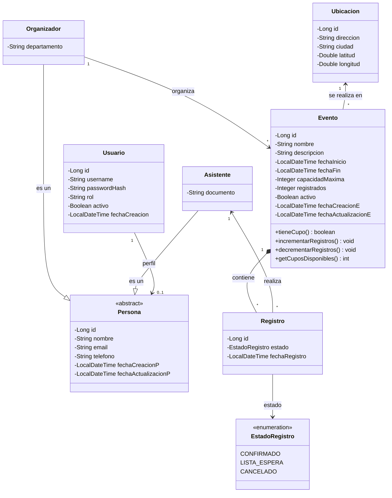
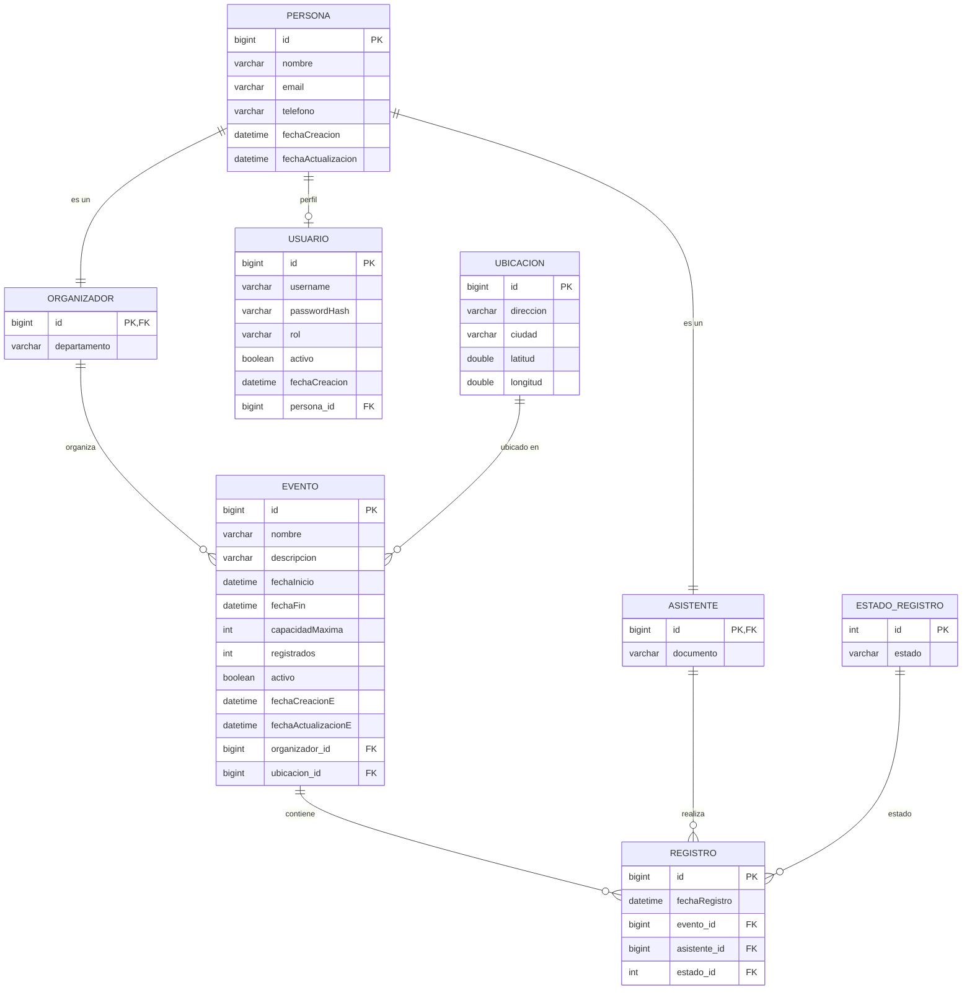
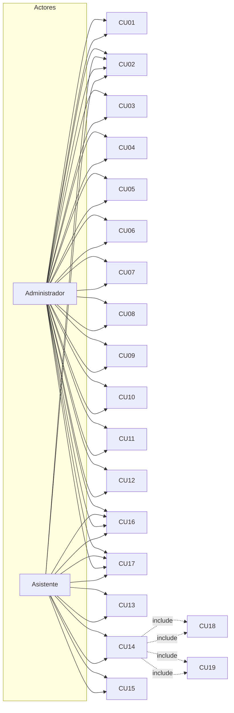

# 🎟️ API para Gestión de Eventos y Asistentes

### **UNIVERSIDAD DE EL SALVADOR**
**Facultad Multidisciplinaria de Occidente**  
**Departamento de Ingeniería y Arquitectura**  
**Ingeniería en Desarrollo de Software**

**Asignatura:** Programación Orientada a Objetos (Ciclo IV / Segundo año — Ciclo II/2026)  
**Coordinadora de Cátedra:** MEd. Angela López de Granillo  
**Tutor GT01:** Erick Adiel Trigueros Jerez  
**Fecha:** 26/09/2026

---

## 👥 Equipo de Trabajo

| Alumno/a | Carnet | Rol / Responsabilidad |
| :--- | :---: | :--- |
| **Castillo Zepeda, Azucena del Carmen** | `CZ08008` | Diseño de Base de Datos y analisis ER |
| **Calzada Vargas, Carlos Enoc** | `CV19058` | Análisis, Casos de Uso y Documentación |
| **Portillo Consuegra, Ronnie Odir** | `PC15016` | Creación de Repositorio GIT, README y Validaciones de Negocio |
| **Serrano Benavides, Ángel Gustavo** | `SB22013` | Arquitectura de Clases UML, DTOs y Servicios |

---

## 📑 Tabla de Contenidos

* [1. Descripción General del Sistema](#1-descripción-general-del-sistema)
* [2. Arquitectura de Dominio (Diagrama de Clases UML)](#2-arquitectura-de-dominio-diagrama-de-clases-uml)
* [3. Modelo de Datos (Diagrama Entidad-Relación)](#3-modelo-de-datos-diagrama-entidad-relación)
* [4. Actores del Sistema](#4-actores-del-sistema)
* [5. Reglas de Negocio](#5-reglas-de-negocio)
* [6. Catálogo de Casos de Uso](#6-catálogo-de-casos-de-uso)
* [7. Fichas Detalladas de Casos de Uso](#7-fichas-detalladas-de-casos-de-uso)
* [8. Matrices de Trazabilidad y CRUD](#8-matrices-de-trazabilidad-y-crud)
* [9. Glosario de Términos](#9-glosario-de-términos)

---

## 1. Descripción General del Sistema

La **API para Gestión de Eventos y Asistentes** permite administrar eventos que ocurren en una ubicación física determinada, gestionar el catálogo de ubicaciones y asistentes, y controlar el registro a dichos eventos garantizando la capacidad máxima definida.

El sistema expone operaciones `GET`, `POST`, `PUT` y `DELETE` para cada entidad y concentra su lógica de negocio en dos reglas críticas:
1. **Control estricto de capacidad:** Un evento no puede admitir más registros activos que su aforo máximo (`capacidadMaxima`).
2. **Registro único:** Un asistente no puede contar con dos inscripciones activas concurrentes para el mismo evento.

---

## 2. Arquitectura de Dominio (Diagrama de Clases UML)

El diseño orientado a objetos implementa herencia con clases abstractas, encapsulamiento, enumeraciones de estado y relaciones de agregación y composición:

<b>🔍 Ver Detalles de Responsabilidades de Clases</b>

* **`Persona` (Clase Abstracta):** Agrupa los atributos comunes de identificación y contacto (`id`, `nombre`, `email`, `telefono`, fechas de auditoría)[span_24](start_span)[span_24](end_span).
* **`Organizador`:** Extiende de `Persona` y define el departamento organizacional responsable[span_25](start_span)[span_25](end_span).
* **`Asistente`:** Extiende de `Persona` e incorpora el documento de identificación[span_26](start_span)[span_26](end_span).
* **`Usuario`:** Administra credenciales seguras (`passwordHash`), perfil de rol y estado activo[span_27](start_span)[span_27](end_span).
* **`Evento`:** Contiene los datos temporales, capacidad máxima y métodos del dominio para validar disponibilidad (`tieneCupo()`, `getCuposDisponibles()`, `incrementarRegistros()`)[span_28](start_span)[span_28](end_span).
* **`Ubicacion`:** Modela el espacio físico con dirección y coordenadas geográficas (`latitud`, `longitud`)[span_29](start_span)[span_29](end_span).
* **`Registro`:** Entidad asociativa con el estado de inscripción gestionado mediante el enum `EstadoRegistro`[span_30](start_span)[span_30](end_span).

---

## 3. Modelo de Datos (Diagrama Entidad-Relación)

Modelo físico de base de datos relacional para soportar las entidades y relaciones del sistema[span_31](start_span)[span_31](end_span):

---

## 4. Actores del Sistema

| Actor | Tipo | Descripción |
| :--- | :---: | :--- |
| **Administrador** | Primario | Personal que administra el sistema. Gestiona el CRUD completo de eventos, ubicaciones y asistentes, y monitorea la ocupación de los eventos.[span_32](start_span)[span_32](end_span) |
| **Asistente** | Primario | Persona que consulta los eventos disponibles, se registra en un evento y puede cancelar su registro.[span_33](start_span)[span_33](end_span) |
| **Sistema** | Casos Incluidos | El sistema ejecuta internamente las validaciones *Validar capacidad disponible* (`CU-18`) y *Validar registro único* (`CU-19`), invocadas de forma obligatoria (`<<include>>`) por el caso de uso *Registrarse en un evento* (`CU-14`).[span_34](start_span)[span_34](end_span) |

---

## 5. Reglas de Negocio

<b>📋 Listado Oficial de Reglas de Negocio (RN-01 a RN-12)</b>

| Código | Regla | Aplica a |
| :---: | :--- | :--- |
| **RN-01** | La capacidad máxima de un evento debe ser mayor que cero. | `CU-01`, `CU-03` |
| **RN-02** | El cupo disponible = capacidad máxima − registros activos. | `CU-14`, `CU-16` |
| **RN-03** | No se permite registrar a un asistente si el cupo disponible es 0. | `CU-14`, `CU-18` |
| **RN-04** | Un asistente no puede tener dos registros activos en el mismo evento. | `CU-14`, `CU-19` |
| **RN-05** | No se puede reducir la capacidad máxima por debajo del número de inscritos activos. | `CU-03` |
| **RN-06** | No se puede eliminar un evento que tenga registros activos. | `CU-04` |
| **RN-07** | No se puede eliminar una ubicación que tenga eventos asociados. | `CU-08` |
| **RN-08** | No se puede eliminar un asistente que tenga registros activos. | `CU-12` |
| **RN-09** | El correo electrónico de un asistente debe ser único. | `CU-09`, `CU-11` |
| **RN-10** | Solo se puede registrar a un evento en estado PUBLICADO y con fecha futura. | `CU-13`, `CU-14` |
| **RN-11** | Al cancelar un registro se libera un cupo del evento. | `CU-15` |
| **RN-12** | Cada evento se realiza en una única ubicación (relación N:1).[span_35](start_span)[span_35](end_span) | `CU-01`, `CU-05` |

---

## 6. Catálogo de Casos de Uso

<b>📑 Ver Tabla Resumen de los 19 Casos de Uso</b>

| Código | Caso de uso | Actor(es) | Tipo |
| :---: | :--- | :--- | :---: |
| `CU-01` | Crear evento | Administrador[span_80](start_span)[span_80](end_span) | CRUD |
| `CU-02` | Consultar eventos | Administrador[span_81](start_span)[span_81](end_span) | CRUD |
| `CU-03` | Actualizar evento | Administrador[span_82](start_span)[span_82](end_span) | CRUD |
| `CU-04` | Eliminar evento | Administrador[span_83](start_span)[span_83](end_span) | CRUD |
| `CU-05` | Crear ubicación | Administrador[span_84](start_span)[span_84](end_span) | CRUD |
| `CU-06` | Consultar ubicaciones | Administrador[span_85](start_span)[span_85](end_span) | CRUD |
| `CU-07` | Actualizar ubicación | Administrador[span_86](start_span)[span_86](end_span) | CRUD |
| `CU-08` | Eliminar ubicación | Administrador[span_87](start_span)[span_87](end_span) | CRUD |
| `CU-09` | Crear asistente | Administrador[span_88](start_span)[span_88](end_span) | CRUD |
| `CU-10` | Consultar asistentes | Administrador[span_89](start_span)[span_89](end_span) | CRUD |
| `CU-11` | Actualizar asistente | Administrador[span_90](start_span)[span_90](end_span) | CRUD |
| `CU-12` | Eliminar asistente | Administrador[span_91](start_span)[span_91](end_span) | CRUD |
| `CU-13` | Consultar eventos disponibles | Asistente[span_92](start_span)[span_92](end_span) | Negocio |
| `CU-14` | Registrarse en un evento | Asistente[span_93](start_span)[span_93](end_span) | Negocio (crítico) |
| `CU-15` | Cancelar registro | Asistente[span_94](start_span)[span_94](end_span) | Negocio |
| `CU-16` | Consultar disponibilidad de cupo | Administrador y Asistente[span_95](start_span)[span_95](end_span) | Negocio (compartido) |
| `CU-17` | Listar asistentes de un evento | Administrador y Asistente[span_96](start_span)[span_96](end_span) | Negocio (compartido) |
| `CU-18` | Validar capacidad disponible | (incluido)[span_97](start_span)[span_97](end_span) | `<<include>>`[span_98](start_span)[span_98](end_span) |
| `CU-19` | Validar registro único | (incluido)[span_99](start_span)[span_99](end_span) | `<<include>>`[span_100](start_span)[span_100](end_span) |

---

## 7. Fichas Detalladas de Casos de Uso

<b>⭐ CU-14 · Registrarse en un evento (Caso de Uso Crítico)</b>

| Campo | Descripción |
| :--- | :--- |
| **Código** | `CU-14` |
| **Nombre** | Registrarse en un evento |
| **Actor** | Asistente |
| **Descripción** | Permite que un asistente registrado se inscriba en un evento publicado, siempre que exista cupo disponible y que no se haya inscrito antes en ese mismo evento. |
| **Precondiciones** | • El evento existe y está en estado PUBLICADO. • La fecha y hora del evento no han pasado. • El asistente existe en el sistema. • El asistente se encuentra autenticado. |
| **Postcondiciones** | • **Éxito:** se crea un registro con estado ACTIVO y la fecha/hora del registro; el cupo disponible del evento disminuye en 1. • **Fallo:** no se crea ningún registro y el cupo del evento permanece sin cambios. |
| **Casos Relacionados** | `<<include>> CU-18 Validar capacidad disponible` · `<<include>> CU-19 Validar registro único` |

**Flujo Normal:**
1. El asistente consulta los eventos disponibles (`CU-13`).
2. El asistente selecciona un evento y solicita registrarse en él.
3. El sistema valida que el evento exista y esté en estado `PUBLICADO`.
4. El sistema valida que el asistente exista en el sistema.
5. El sistema valida que el asistente no tenga un registro activo en ese evento (`CU-19`).
6. El sistema valida que exista cupo disponible (`CU-18`).
7. El sistema crea el registro con estado `ACTIVO` y la fecha/hora actual.
8. El sistema actualiza la ocupación del evento (cupo disponible − 1).
9. El sistema confirma el registro y muestra los datos del registro y el cupo restante.

**Flujos Alternativos y Excepciones:**
* **3a.** El evento no existe $\rightarrow$ Error `404 Not Found` — *"El evento indicado no existe"*. Fin del caso de uso.
* **3b.** El evento no está publicado (borrador, cancelado o finalizado) $\rightarrow$ Error `409 Conflict` — *"El evento no está disponible para registro"*. Fin del caso de uso.
* **3c.** La fecha del evento ya pasó $\rightarrow$ Error `409 Conflict` — *"El evento ya se realizó"*. Fin del caso de uso.
* **4a.** El asistente no existe $\rightarrow$ Error `404 Not Found` — *"El asistente no está registrado"*. Fin del caso de uso.
* **5a.** El asistente ya está registrado en ese evento $\rightarrow$ Error `409 Conflict` — *"El asistente ya está registrado en este evento"*. No se crea el registro.
* **6a.** El evento alcanzó su capacidad máxima (cupo disponible = 0) $\rightarrow$ Error `409 Conflict` — *"El evento alcanzó su capacidad máxima"*. No se crea el registro.
* **7a.** Falla inesperada al guardar $\rightarrow$ Error `500 Internal Server Error` — *"Ocurrió un error al procesar el registro"*. Se revierte la transacción.

**Trazabilidad Técnica:**
* **Método:** `POST`
* **Endpoint:** `/api/eventos/{idEvento}/registros`
* **Respuesta Exitosa:** `201 Created` con el registro creado.

<b>🔄 CU-15 · Cancelar registro</b>

| Campo | Descripción |
| :--- | :--- |
| **Código** | `CU-15` |
| **Nombre** | Cancelar registro |
| **Actor** | Asistente (o Administrador en representación del asistente) |
| **Descripción** | Permite anular la inscripción de un asistente a un evento, cambiando el estado del registro a CANCELADO y liberando el cupo ocupado. |
| **Precondiciones** | • Existe un registro con estado ACTIVO para el evento y el asistente indicados. • El registro pertenece al asistente que solicita la cancelación (o el solicitante es Administrador). |
| **Postcondiciones** | • **Éxito:** el registro cambia a estado CANCELADO y el cupo disponible del evento aumenta en 1. • **Fallo:** el registro permanece en estado ACTIVO y el cupo no cambia. |
| **Casos Relacionados**| Extiende el resultado de `CU-14` (aplica la regla **RN-11**). |

**Flujo Normal:**
1. El asistente ingresa a "Mis registros" y selecciona el evento que desea cancelar.
2. El sistema muestra el detalle del registro y solicita confirmación.
3. El asistente confirma la cancelación.
4. El sistema valida que el registro exista y esté `ACTIVO`.
5. El sistema cambia el estado del registro a `CANCELADO`.
6. El sistema libera el cupo del evento (cupo disponible + 1).
7. El sistema confirma la cancelación y muestra el nuevo cupo disponible.

**Flujos Alternativos y Excepciones:**
* **4a.** El registro no existe $\rightarrow$ Error `404 Not Found` — *"El registro indicado no existe"*.
* **4b.** El registro ya estaba cancelado $\rightarrow$ Error `409 Conflict` — *"El registro ya fue cancelado anteriormente"*.
* **4c.** El registro no pertenece al asistente solicitante $\rightarrow$ Error `403 Forbidden` — *"No tiene permiso para cancelar este registro"*.
* **4d.** El evento ya se realizó $\rightarrow$ Error `409 Conflict` — *"No se puede cancelar un registro de un evento finalizado"*.

**Trazabilidad Técnica:**
* `PUT /api/registros/{idRegistro}/cancelar` $\rightarrow$ `200 OK` con el registro actualizado.
* `DELETE /api/registros/{idRegistro}` $\rightarrow$ `204 No Content`.

<b>📊 CU-16 · Consultar disponibilidad de cupo (Compartido)</b>

| Campo | Descripción |
| :--- | :--- |
| **Código** | `CU-16` |
| **Nombre** | Consultar disponibilidad de cupo |
| **Actores** | Administrador y Asistente |
| **Descripción** | Permite conocer la capacidad máxima de un evento, la cantidad de asistentes inscritos y cuántos cupos quedan disponibles. |
| **Precondiciones** | El evento existe en el sistema. |
| **Postcondiciones** | No modifica datos (caso de uso de solo consulta). Se muestra la información de ocupación del evento. |

**Flujo Normal:**
1. El actor selecciona un evento.
2. El sistema recupera la capacidad máxima del evento.
3. El sistema cuenta los registros con estado `ACTIVO` del evento.
4. El sistema calcula: $\text{cupo disponible} = \text{capacidad máxima} - \text{inscritos activos}$.
5. El sistema muestra: capacidad máxima, inscritos y cupos disponibles.

**Flujos Alternativos:**
* **2a.** El evento no existe $\rightarrow$ Error `404 Not Found` — *"El evento indicado no existe"*.

**Trazabilidad Técnica:**
* **Método:** `GET`
* **Endpoint:** `/api/eventos/{idEvento}/disponibilidad`
* **Respuesta Exitosa:** `200 OK` con `{ capacidadMaxima, inscritos, disponibles }`.

<b>👥 CU-17 · Listar asistentes de un evento (Compartido)</b>

| Campo | Descripción |
| :--- | :--- |
| **Código** | `CU-17` |
| **Nombre** | Listar asistentes de un evento |
| **Actores** | Administrador y Asistente |
| **Descripción** | Permite obtener la lista de asistentes inscritos (activos) en un evento determinado. |
| **Precondiciones** | El evento existe en el sistema. |
| **Postcondiciones** | No modifica datos. Se devuelve el listado de asistentes inscritos con su fecha de registro. |

**Flujo Normal:**
1. El actor selecciona un evento y solicita ver sus asistentes.
2. El sistema valida que el evento exista.
3. El sistema recupera los registros `ACTIVOS` del evento y los asistentes asociados.
4. El sistema muestra el listado (nombre, correo y fecha de registro de cada asistente).

**Flujos Alternativos:**
* **2a.** El evento no existe $\rightarrow$ Error `404 Not Found` — *"El evento indicado no existe"*.
* **3a.** El evento no tiene asistentes inscritos $\rightarrow$ El sistema muestra el listado vacío con un mensaje informativo.

**Trazabilidad Técnica:**
* **Método:** `GET`
* **Endpoint:** `/api/eventos/{idEvento}/asistentes`
* **Respuesta Exitosa:** `200 OK` con el listado de asistentes.

<b>🔍 CU-13 · Consultar eventos disponibles</b>

| Campo | Descripción |
| :--- | :--- |
| **Código** | `CU-13` |
| **Nombre** | Consultar eventos disponibles |
| **Actor** | Asistente |
| **Descripción** | Permite al asistente ver únicamente los eventos publicados, con fecha futura y con cupo disponible. |
| **Precondiciones** | Ninguna (consulta pública). |
| **Postcondiciones** | No modifica datos. Se muestra el listado de eventos disponibles. |

**Flujo Normal:**
1. El asistente ingresa a la sección de eventos disponibles.
2. El sistema filtra los eventos con estado `PUBLICADO`.
3. El sistema descarta los eventos cuya fecha ya pasó.
4. El sistema calcula el cupo disponible de cada evento.
5. El sistema muestra únicamente los eventos con cupo disponible mayor que cero.

**Flujos Alternativos:**
* **5a.** No hay eventos que cumplan los criterios $\rightarrow$ El sistema muestra el listado vacío con un mensaje informativo.

**Trazabilidad Técnica:**
* **Método:** `GET`
* **Endpoint:** `/api/eventos/disponibles`
* **Respuesta Exitosa:** `200 OK` con el listado de eventos.

<b>⚙️ Casos Incluidos: CU-18 y CU-19 (Lógica Interna)</b>

#### CU-18 · Validar capacidad disponible
* **Actor:** Ninguno (Caso de uso incluido por `CU-14`).
* **Descripción:** Verifica que el evento tenga cupo disponible antes de permitir un nuevo registro.
* **Precondiciones:** El evento existe y se ha recuperado su capacidad máxima y el número de inscritos activos.
* **Postcondiciones:** Se determina si el registro puede continuar (hay cupo) o debe rechazarse (evento lleno).
* **Flujo Normal:**
    1. El sistema obtiene la capacidad máxima del evento.
    2. El sistema cuenta los registros con estado `ACTIVO` del evento.
    3. El sistema calcula: $\text{cupo disponible} = \text{capacidad máxima} - \text{inscritos activos}$.
    4. El sistema verifica que el cupo disponible sea mayor que cero (**RN-03**).
    5. El sistema informa que existe cupo disponible y el caso de uso continúa.
* **Excepción (4a):** El cupo disponible es igual a cero $\rightarrow$ El sistema informa *"El evento alcanzó su capacidad máxima"* y `CU-14` termina con error `409 Conflict`.
* **Trazabilidad:** Lógica de negocio en capa de servicio (`RegistroService`), sin endpoint público.

---

#### CU-19 · Validar registro único
* **Actor:** Ninguno (Caso de uso incluido por `CU-14`).
* **Descripción:** Verifica que el asistente no tenga ya un registro activo en el evento al que intenta inscribirse.
* **Precondiciones:** El evento y el asistente existen.
* **Postcondiciones:** Se determina si el registro puede continuar o si debe rechazarse por duplicidad.
* **Flujo Normal:**
    1. El sistema consulta los registros existentes del asistente en el evento indicado.
    2. El sistema verifica que no exista un registro con estado `ACTIVO` (**RN-04**).
    3. El sistema informa que el registro es único y el caso de uso continúa.
* **Excepción (2a):** Ya existe un registro `ACTIVO` para ese asistente y evento $\rightarrow$ El sistema informa *"El asistente ya está registrado en este evento"* y `CU-14` termina con error `409 Conflict`.
* **Trazabilidad:** Lógica de negocio en capa de servicio (`RegistroService`), sin endpoint público.

<b>🛠️ Fichas CRUD de Eventos: CU-01 a CU-04</b>

#### CU-01 · Crear evento
* **Actor:** Administrador
* **Descripción:** Permite registrar un nuevo evento indicando sus datos generales, la ubicación donde se realizará y la capacidad máxima de asistentes.
* **Precondiciones:** Administrador autenticado. Existe al menos una ubicación registrada en el sistema.
* **Postcondiciones:** Éxito: el evento queda registrado con estado `BORRADOR` y su cupo disponible igual a la capacidad máxima.
* **Excepciones:** `400 Bad Request` por campos vacíos o capacidad $\le 0$ (**RN-01**), o fecha anterior a la actual; `404 Not Found` si la ubicación no existe.
* **Endpoint:** `POST /api/eventos` $\rightarrow$ `201 Created`.

#### CU-02 · Consultar eventos
* **Actor:** Administrador
* **Descripción:** Permite listar todos los eventos del sistema (con filtros opcionales por estado, fecha o ubicación) y consultar el detalle de uno en particular.
* **Precondiciones:** Administrador autenticado.
* **Endpoints:** `GET /api/eventos` y `GET /api/eventos/{idEvento}` $\rightarrow$ `200 OK`.

#### CU-03 · Actualizar evento
* **Actor:** Administrador
* **Descripción:** Permite modificar los datos de un evento existente (nombre, descripción, fecha, hora, capacidad máxima, ubicación y estado).
* **Precondiciones:** El evento existe en el sistema.
* **Excepciones:** `404 Not Found` (no existe); `400 Bad Request` (datos inválidos); `409 Conflict` si la nueva capacidad es menor que los inscritos activos (**RN-05**).
* **Endpoint:** `PUT /api/eventos/{idEvento}` $\rightarrow$ `200 OK`.

#### CU-04 · Eliminar evento
* **Actor:** Administrador
* **Descripción:** Permite eliminar de forma definitiva un evento que no tenga asistentes inscritos de forma activa.
* **Precondiciones:** El evento existe y no posee registros con estado `ACTIVO`.
* **Excepciones:** `404 Not Found` (no existe); `409 Conflict` si el evento tiene registros activos (**RN-06**).
* **Endpoint:** `DELETE /api/eventos/{idEvento}` $\rightarrow$ `204 No Content`.

<b>📍 Fichas CRUD de Ubicaciones: CU-05 a CU-08</b>

#### CU-05 · Crear ubicación
* **Actor:** Administrador
* **Descripción:** Permite registrar una nueva ubicación (lugar físico) donde pueden realizarse eventos.
* **Excepciones:** `400 Bad Request` por campos obligatorios vacíos o formato erróneo.
* **Endpoint:** `POST /api/ubicaciones` $\rightarrow$ `201 Created`.

#### CU-06 · Consultar ubicaciones
* **Actor:** Administrador
* **Descripción:** Permite listar todas las ubicaciones registradas y consultar el detalle de una en particular, incluyendo los eventos asociados.
* **Endpoints:** `GET /api/ubicaciones` y `GET /api/ubicaciones/{idUbicacion}` $\rightarrow$ `200 OK`.

#### CU-07 · Actualizar ubicación
* **Actor:** Administrador
* **Descripción:** Permite modificar los datos de una ubicación existente.
* **Excepciones:** `404 Not Found` (no existe); `400 Bad Request` (datos inválidos).
* **Endpoint:** `PUT /api/ubicaciones/{idUbicacion}` $\rightarrow$ `200 OK`.

#### CU-08 · Eliminar ubicación
* **Actor:** Administrador
* **Descripción:** Permite eliminar una ubicación que no tenga eventos asociados.
* **Precondiciones:** La ubicación existe y no tiene eventos asociados.
* **Excepciones:** `404 Not Found` (no existe); `409 Conflict` si tiene eventos asociados (**RN-07**).
* **Endpoint:** `DELETE /api/ubicaciones/{idUbicacion}` $\rightarrow$ `204 No Content`.

<b>👤 Fichas CRUD de Asistentes: CU-09 a CU-12</b>

#### CU-09 · Crear asistente
* **Actor:** Administrador
* **Descripción:** Permite registrar un nuevo asistente en el sistema con sus datos personales y de contacto.
* **Excepciones:** `400 Bad Request` (campos vacíos); `409 Conflict` si el correo ya está registrado (**RN-09**).
* **Endpoint:** `POST /api/asistentes` $\rightarrow$ `201 Created`.

#### CU-10 · Consultar asistentes
* **Actor:** Administrador
* **Descripción:** Permite listar todos los asistentes registrados y consultar el detalle de uno en particular, incluyendo los eventos en los que se ha inscrito.
* **Endpoints:** `GET /api/asistentes` y `GET /api/asistentes/{idAsistente}` $\rightarrow$ `200 OK`.

#### CU-11 · Actualizar asistente
* **Actor:** Administrador
* **Descripción:** Permite modificar los datos de un asistente existente.
* **Excepciones:** `404 Not Found` (no existe); `400 Bad Request` (datos inválidos); `409 Conflict` si el nuevo correo pertenece a otro asistente (**RN-09**).
* **Endpoint:** `PUT /api/asistentes/{idAsistente}` $\rightarrow$ `200 OK`.

#### CU-12 · Eliminar asistente
* **Actor:** Administrador
* **Descripción:** Permite eliminar un asistente que no tenga registros activos en eventos.
* **Precondiciones:** El asistente existe y no posee registros con estado `ACTIVO`.
* **Excepciones:** `404 Not Found` (no existe); `409 Conflict` si el asistente tiene registros activos (**RN-08**).
* **Endpoint:** `DELETE /api/asistentes/{idAsistente}` $\rightarrow$ `204 No Content`.

---

## 8. Matriz CRUD de Entidades Principales

| Entidad | Caso de uso | Método | Endpoint | Actor | Error principal |
| :--- | :--- | :---: | :--- | :--- | :--- |
| **Evento** | Crear evento (`CU-01`) | `POST` | `/api/eventos` | Administrador | `400` datos inválidos |
| **Evento** | Consultar eventos (`CU-02`) | `GET` | `/api/eventos` · `/api/eventos/{id}` | Administrador | `404` no existe |
| **Evento** | Actualizar evento (`CU-03`) | `PUT` | `/api/eventos/{id}` | Administrador | `409` capacidad < inscritos |
| **Evento** | Eliminar evento (`CU-04`) | `DELETE` | `/api/eventos/{id}` | Administrador | `409` tiene inscritos |
| **Ubicación** | Crear ubicación (`CU-05`) | `POST` | `/api/ubicaciones` | Administrador | `400` datos inválidos |
| **Ubicación** | Consultar ubicaciones (`CU-06`) | `GET` | `/api/ubicaciones` · `/api/ubicaciones/{id}` | Administrador | `404` no existe |
| **Ubicación** | Actualizar ubicación (`CU-07`) | `PUT` | `/api/ubicaciones/{id}` | Administrador | `400` datos inválidos |
| **Ubicación** | Eliminar ubicación (`CU-08`) | `DELETE` | `/api/ubicaciones/{id}` | Administrador | `409` tiene eventos |
| **Asistente** | Crear asistente (`CU-09`) | `POST` | `/api/asistentes` | Administrador | `409` correo duplicado |
| **Asistente** | Consultar asistentes (`CU-10`) | `GET` | `/api/asistentes` · `/api/asistentes/{id}` | Administrador | `404` no existe |
| **Asistente** | Actualizar asistente (`CU-11`) | `PUT` | `/api/asistentes/{id}` | Administrador | `409` correo duplicado |
| **Asistente** | Eliminar asistente (`CU-12`) | `DELETE` | `/api/asistentes/{id}` | Administrador | `409` tiene registros |

---

## 9. Matriz de Trazabilidad Técnica (Caso de Uso → Endpoint)

| Código | Caso de uso | Método HTTP | Endpoint | Actor |
| :---: | :--- | :---: | :--- | :--- |
| `CU-01` | Crear evento | `POST` | `/api/eventos` | Administrador |
| `CU-02` | Consultar eventos | `GET` | `/api/eventos` | Administrador |
| `CU-03` | Actualizar evento | `PUT` | `/api/eventos/{id}` | Administrador |
| `CU-04` | Eliminar evento | `DELETE` | `/api/eventos/{id}` | Administrador |
| `CU-05` | Crear ubicación | `POST` | `/api/ubicaciones` | Administrador |
| `CU-06` | Consultar ubicaciones | `GET` | `/api/ubicaciones` | Administrador |
| `CU-07` | Actualizar ubicación | `PUT` | `/api/ubicaciones/{id}` | Administrador |
| `CU-08` | Eliminar ubicación | `DELETE` | `/api/ubicaciones/{id}` | Administrador |
| `CU-09` | Crear asistente | `POST` | `/api/asistentes` | Administrador |
| `CU-10` | Consultar asistentes | `GET` | `/api/asistentes` | Administrador |
| `CU-11` | Actualizar asistente | `PUT` | `/api/asistentes/{id}` | Administrador |
| `CU-12` | Eliminar asistente | `DELETE` | `/api/asistentes/{id}` | Administrador |
| `CU-13` | Consultar eventos disponibles | `GET` | `/api/eventos/disponibles` | Asistente |
| `CU-14` | Registrarse en un evento | `POST` | `/api/eventos/{id}/registros` | Asistente |
| `CU-15` | Cancelar registro | `PUT` / `DELETE` | `/api/registros/{id}/cancelar` · `/api/registros/{id}` | Asistente |
| `CU-16` | Consultar disponibilidad de cupo | `GET` | `/api/eventos/{id}/disponibilidad` | Ambos |
| `CU-17` | Listar asistentes de un evento | `GET` | `/api/eventos/{id}/asistentes` | Ambos |
| `CU-18` | Validar capacidad disponible | — | Interno (`RegistroService`) | Sistema |
| `CU-19` | Validar registro único | — | Interno (`RegistroService`) | Sistema |

---

## 10. Glosario de Términos

* **Evento:** Actividad programada en una fecha, hora y ubicación determinadas, con una capacidad máxima de asistentes[span_101](start_span)[span_101](end_span).
* **Ubicación:** Lugar físico donde se realiza un evento (`nombre`, `direccion`, `ciudad`, `latitud`, `longitud`)[span_102](start_span)[span_102](end_span).
* **Asistente:** Persona registrada en el sistema que puede inscribirse en eventos[span_103](start_span)[span_103](end_span).
* **Registro:** Inscripción de un asistente a un evento. Entidad que resuelve la relación muchos a muchos entre Evento y Asistente[span_104](start_span)[span_104](end_span).
* **Capacidad máxima:** Número máximo de asistentes que puede tener un evento[span_105](start_span)[span_105](end_span).
* **Cupo disponible:** Capacidad máxima menos el número de registros activos.
* **Estado del evento:** `BORRADOR`, `PUBLICADO`, `CANCELADO` o `FINALIZADO`.
* **Estado del registro:** `CONFIRMADO`, `LISTA_ESPERA` o `CANCELADO`[span_106](start_span)[span_106](end_span).

---

  Proyecto de Cátedra — Programación Orientada a Objetos | Universidad de El Salvador, FMOcc.

