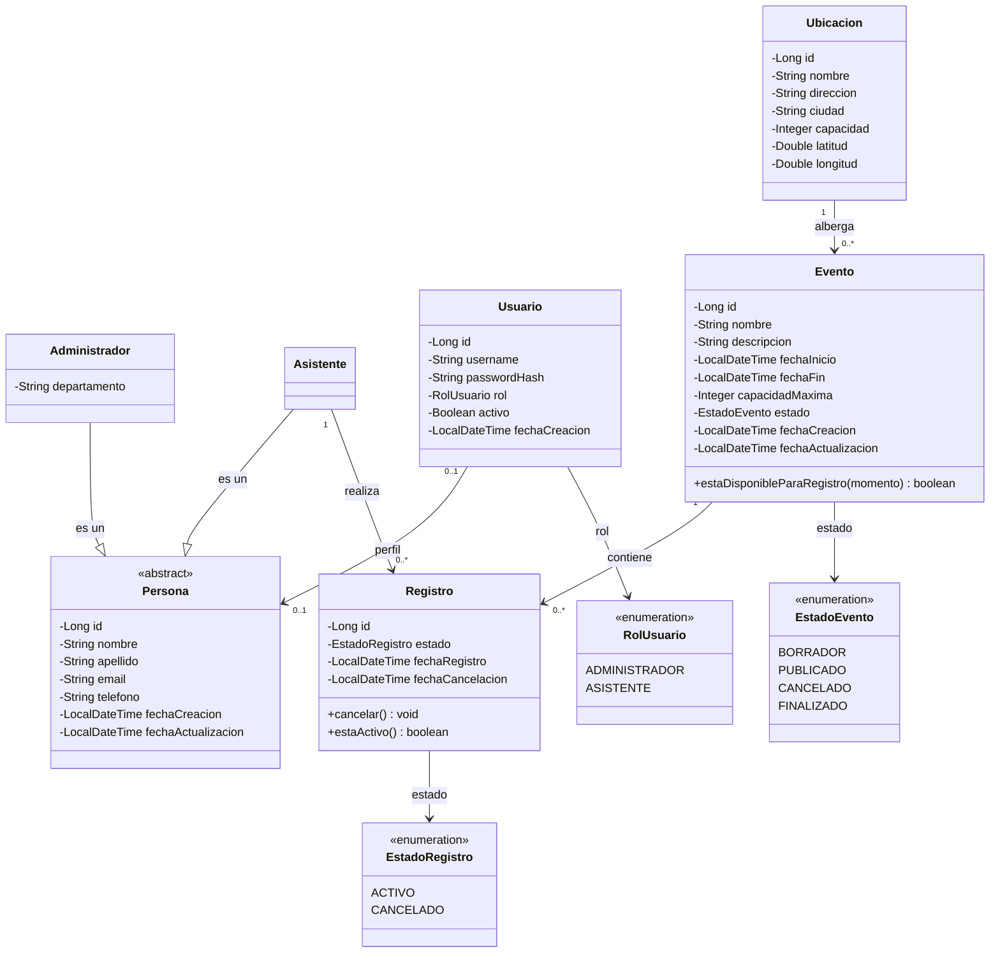
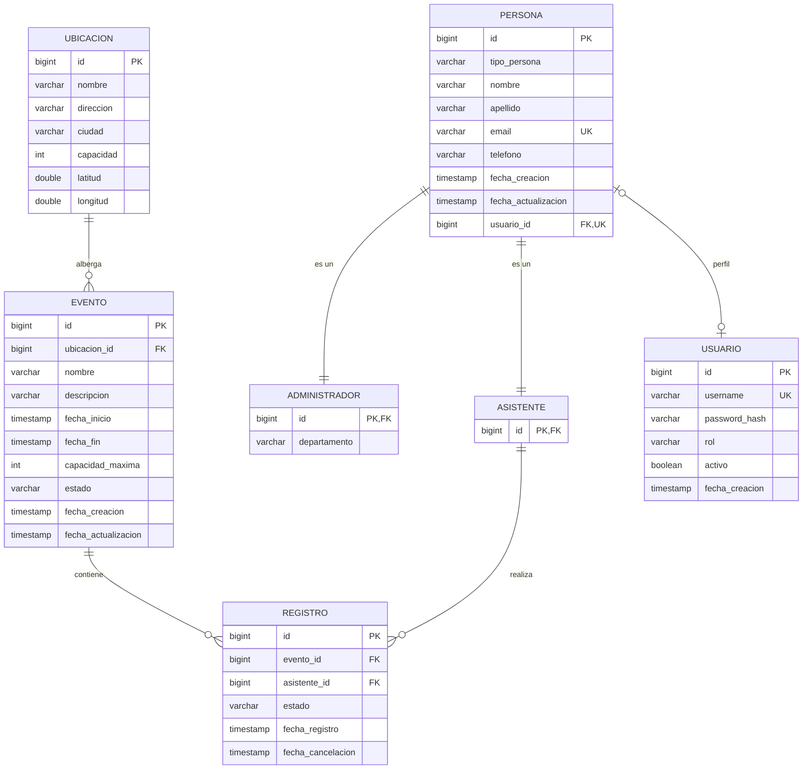
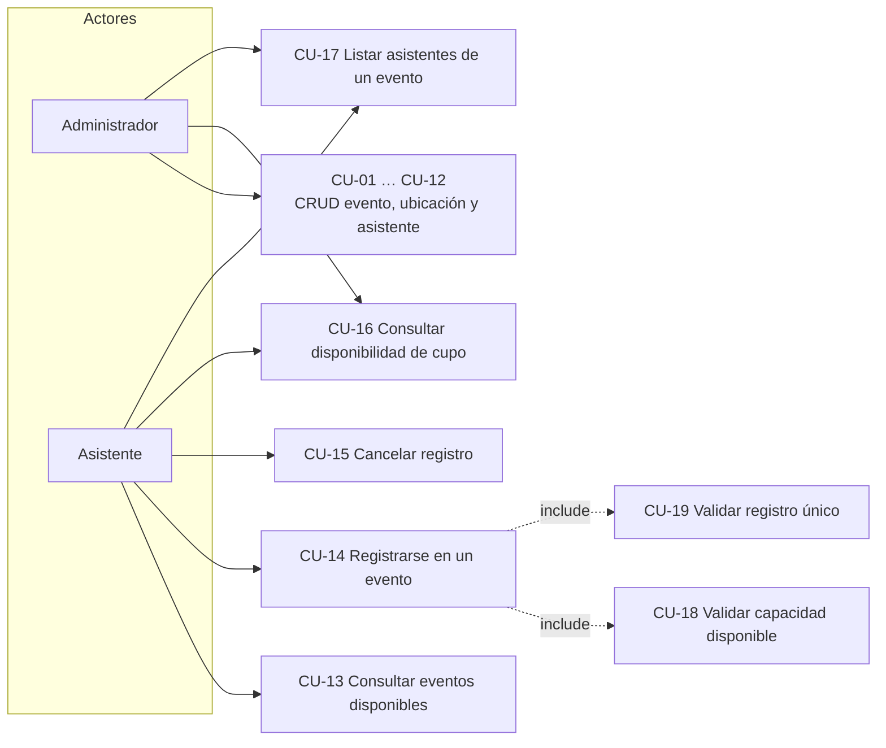

# 🎟️ API para Gestión de Eventos y Asistentes

<div align="center">


### **UNIVERSIDAD DE EL SALVADOR**
**Facultad Multidisciplinaria de Occidente**  
**Departamento de Ingeniería y Arquitectura**  
**Ingeniería en Desarrollo de Software**

**Asignatura:** Programación Orientada a Objetos (Ciclo IV / Segundo año — Ciclo II/2026)  
**Coordinadora de Cátedra:** MEd. Angela López de Granillo  
**Tutor GT01:** Erick Adiel Trigueros Jerez  
**Fecha:** 26/09/2026

</div>

---

## 👥 Equipo de Trabajo

| Alumno/a | Carnet | Rol / Responsabilidad |
| :--- | :---: | :--- |
| **Castillo Zepeda, Azucena del Carmen** | `CZ08008` | Administrador, relaciones DB y pruebas |
| **Calzada Vargas, Carlos Enoc** | `CV19058` | Registro, pipeline CI/CD y documentación |
| **Portillo Consuegra, Ronnie Odir** | `PC15016` | Evento, Docker y Kubernetes |
| **Serrano Benavides, Ángel Gustavo** | `SB22013` | Usuario, Swagger y pruebas de asistencia |

---

## 📑 Tabla de Contenidos

* [1. Descripción General del Sistema](#1-descripción-general-del-sistema)
* [2. Arquitectura de Dominio (Diagrama de Clases UML)](#2-arquitectura-de-dominio-diagrama-de-clases-uml)
* [3. Modelo de Datos (Diagrama Entidad-Relación)](#3-modelo-de-datos-diagrama-entidad-relación)
* [4. Actores del Sistema](#4-actores-del-sistema)
* [5. Reglas de Negocio](#5-reglas-de-negocio)
* [6. Catálogo de Casos de Uso](#6-catálogo-de-casos-de-uso)
* [7. Fichas Detalladas de Casos de Uso](#7-fichas-detalladas-de-casos-de-uso)
* [8. Matriz CRUD de Entidades Principales](#8-matriz-crud-de-entidades-principales)
* [9. Matriz de Trazabilidad Técnica](#9-matriz-de-trazabilidad-técnica-caso-de-uso--endpoint)
* [10. Glosario de Términos](#10-glosario-de-términos)
* [11. Tecnologías y Requisitos](#11-tecnologías-y-requisitos)
* [12. Puesta en Marcha](#12-puesta-en-marcha)
* [13. Endpoints de la API](#13-endpoints-de-la-api)
* [14. Colección de Postman](#14-colección-de-postman)
* [15. Pruebas Automatizadas](#15-pruebas-automatizadas)
* [16. Estructura del Proyecto](#16-estructura-del-proyecto)
* [17. Problemas Frecuentes](#17-problemas-frecuentes)
* [18. Historial de la Entrega #2](#18-historial-de-la-entrega-2)
* [19. Swagger y OpenAPI](#19-swagger-y-openapi)
* [20. Docker y Kubernetes local](#20-docker-y-kubernetes-local)
* [21. Pipeline local con act](#21-pipeline-local-con-act)
* [22. Entrega #3: Reparto por Ramas](#22-entrega-3-reparto-por-ramas)
* [23. Documentación y Defensa](#23-documentación-y-defensa)

---

## 1. Descripción General del Sistema

La **API para Gestión de Eventos y Asistentes** permite administrar eventos que ocurren en una ubicación física determinada, gestionar el catálogo de ubicaciones, asistentes, credenciales y administradores, y controlar el registro a dichos eventos garantizando la capacidad máxima definida.

El sistema expone 32 operaciones `GET`, `POST`, `PUT` y `DELETE` para las seis entidades concretas del UML: Ubicación, Evento, Asistente, Registro, Usuario y Administrador. Concentra su lógica de negocio en estas reglas críticas:

1. **Control estricto de capacidad:** un evento no puede admitir más registros activos que su aforo máximo (`capacidad_maxima`).
2. **Registro único:** un asistente no puede contar con dos inscripciones activas simultáneas para el mismo evento.
3. **Integridad de perfiles:** una persona se vincula como máximo con un usuario y su rol debe corresponder al perfil.
4. **Credenciales protegidas:** las contraseñas se codifican con BCrypt y nunca se devuelven por la API.

---

## 2. Arquitectura de Dominio (Diagrama de Clases UML)

El diseño orientado a objetos implementa herencia con clases abstractas, encapsulamiento, enumeraciones de estado y relaciones de asociación entre las entidades del dominio:


```mermaid
classDiagram
    direction TB

    class Persona {
        <<abstract>>
        -Long id
        -String nombre
        -String apellido
        -String email
        -String telefono
        -LocalDateTime fechaCreacion
        -LocalDateTime fechaActualizacion
    }

    class Administrador {
        -String departamento
    }

    class Asistente

    class Usuario {
        -Long id
        -String username
        -String passwordHash
        -RolUsuario rol
        -Boolean activo
        -LocalDateTime fechaCreacion
    }

    class Ubicacion {
        -Long id
        -String nombre
        -String direccion
        -String ciudad
        -Integer capacidad
        -Double latitud
        -Double longitud
    }

    class Evento {
        -Long id
        -String nombre
        -String descripcion
        -LocalDateTime fechaInicio
        -LocalDateTime fechaFin
        -Integer capacidadMaxima
        -EstadoEvento estado
        -LocalDateTime fechaCreacion
        -LocalDateTime fechaActualizacion
        +estaDisponibleParaRegistro(momento) boolean
    }

    class Registro {
        -Long id
        -EstadoRegistro estado
        -LocalDateTime fechaRegistro
        -LocalDateTime fechaCancelacion
        +cancelar() void
        +estaActivo() boolean
    }

    class EstadoEvento {
        <<enumeration>>
        BORRADOR
        PUBLICADO
        CANCELADO
        FINALIZADO
    }

    class EstadoRegistro {
        <<enumeration>>
        ACTIVO
        CANCELADO
    }

    class RolUsuario {
        <<enumeration>>
        ADMINISTRADOR
        ASISTENTE
    }

    Administrador --|> Persona : es un
    Asistente --|> Persona : es un
    Usuario "0..1" --> "0..1" Persona : perfil
    Ubicacion "1" --> "0..*" Evento : alberga
    Evento "1" --> "0..*" Registro : contiene
    Asistente "1" --> "0..*" Registro : realiza
    Evento --> EstadoEvento : estado
    Registro --> EstadoRegistro : estado
    Usuario --> RolUsuario : rol
```

<details>
<summary><b>🔍 Ver Detalles de Responsabilidades de Clases</b></summary>

* **`Persona` (Clase Abstracta):** agrupa los atributos comunes de identificación y contacto (`id`, `nombre`, `apellido`, `email`, `telefono`, fechas de auditoría).
* **`Administrador`:** extiende de `Persona` y define el departamento organizacional responsable. Es el actor de los casos de uso CU-01 a CU-12.
* **`Asistente`:** extiende de `Persona` sin atributos propios; es el actor que se inscribe a los eventos.
* **`Usuario`:** administra credenciales (`passwordHash`), perfil de rol y estado activo. Se asocia de forma opcional (0..1 : 0..1) con `Persona`, para no obligar a que toda persona tenga credenciales.
* **`Evento`:** contiene los datos temporales, la capacidad máxima y el estado (`BORRADOR`, `PUBLICADO`, `CANCELADO`, `FINALIZADO`). El cupo **no se almacena**: se calcula como `capacidadMaxima − registros ACTIVOS` (RN-02).
* **`Ubicacion`:** modela el espacio físico con nombre, dirección, ciudad, capacidad del lugar y coordenadas geográficas.
* **`Registro`:** entidad asociativa que resuelve la relación muchos a muchos entre `Evento` y `Asistente`, con el estado de la inscripción gestionado mediante el enum `EstadoRegistro`.

</details>

---

## 3. Modelo de Datos (Diagrama Entidad-Relación)

Modelo relacional implementado en PostgreSQL y versionado con Flyway (`V1__schema.sql`):


```mermaid
erDiagram
    PERSONA ||--|| ADMINISTRADOR : "es un"
    PERSONA ||--|| ASISTENTE : "es un"
    PERSONA |o--o| USUARIO : "perfil"
    UBICACION ||--o{ EVENTO : "alberga"
    EVENTO ||--o{ REGISTRO : "contiene"
    ASISTENTE ||--o{ REGISTRO : "realiza"

    USUARIO {
        bigint id PK
        varchar username UK
        varchar password_hash
        varchar rol
        boolean activo
        timestamp fecha_creacion
    }

    PERSONA {
        bigint id PK
        varchar tipo_persona
        varchar nombre
        varchar apellido
        varchar email UK
        varchar telefono
        timestamp fecha_creacion
        timestamp fecha_actualizacion
        bigint usuario_id FK,UK
    }

    ADMINISTRADOR {
        bigint id PK,FK
        varchar departamento
    }

    ASISTENTE {
        bigint id PK,FK
    }

    UBICACION {
        bigint id PK
        varchar nombre
        varchar direccion
        varchar ciudad
        int capacidad
        double latitud
        double longitud
    }

    EVENTO {
        bigint id PK
        bigint ubicacion_id FK
        varchar nombre
        varchar descripcion
        timestamp fecha_inicio
        timestamp fecha_fin
        int capacidad_maxima
        varchar estado
        timestamp fecha_creacion
        timestamp fecha_actualizacion
    }

    REGISTRO {
        bigint id PK
        bigint evento_id FK
        bigint asistente_id FK
        varchar estado
        timestamp fecha_registro
        timestamp fecha_cancelacion
    }
```

**Diagramas en imagen:** [ERD conceptual](docs/entrega-1/erd-conceptual.png) · [ERD relacional](docs/entrega-1/erd-relacional.png) · [Documento completo de alineación (PDF)](docs/entrega-1/alineacion-modelo.pdf).

<details>
<summary><b>🔒 Ver Restricciones e Índices de la Base de Datos</b></summary>

* `RN-01`: `CHECK (capacidad_maxima > 0)` en `EVENTO` y `CHECK (capacidad > 0)` en `UBICACION`.
* `RN-04`: **índice único parcial** `uq_registro_activo (evento_id, asistente_id) WHERE estado = 'ACTIVO'`; impide el registro duplicado a nivel de base de datos y a la vez permite volver a inscribirse después de cancelar.
* `RN-09`: `UNIQUE (email)` en `PERSONA` y `UNIQUE (username)` en `USUARIO`.
* `RN-12`: `EVENTO.ubicacion_id NOT NULL`; cada evento ocurre en una única ubicación.
* Estados controlados con `CHECK`: `EVENTO.estado ∈ (BORRADOR, PUBLICADO, CANCELADO, FINALIZADO)`, `REGISTRO.estado ∈ (ACTIVO, CANCELADO)` y `USUARIO.rol ∈ (ADMINISTRADOR, ASISTENTE)`.
* Borrado: `ADMINISTRADOR`, `ASISTENTE` y `REGISTRO` en cascada desde su padre; antes de eliminar se validan `EVENTO` (RN-06), `UBICACION` (RN-07) y `ASISTENTE` (RN-08).
* `tipo_persona` es la columna técnica de Hibernate para la herencia `JOINED` de `PERSONA`.

</details>

---

## 4. Actores del Sistema

| Actor | Tipo | Descripción |
| :--- | :---: | :--- |
| **Administrador** | Primario | Personal que administra el sistema. Gestiona el CRUD completo de eventos, ubicaciones y asistentes, y monitorea la ocupación de los eventos. |
| **Asistente** | Primario | Persona que consulta los eventos disponibles, se registra en un evento y puede cancelar su registro. |
| **Sistema** | Casos Incluidos | El sistema ejecuta internamente las validaciones *Validar capacidad disponible* (`CU-18`) y *Validar registro único* (`CU-19`), invocadas con `<<include>>` por `CU-14`. |

---

## 5. Reglas de Negocio

<details open>
<summary><b>📋 Listado Oficial de Reglas de Negocio (RN-01 a RN-12)</b></summary>

| Código | Regla | Aplica a |
| :---: | :--- | :--- |
| **RN-01** | La capacidad máxima de un evento debe ser mayor que cero. | `CU-01`, `CU-03` |
| **RN-02** | El cupo disponible = capacidad máxima − registros activos. | `CU-14`, `CU-16` |
| **RN-03** | No se permite registrar a un asistente si el cupo disponible es 0. | `CU-14`, `CU-18` |
| **RN-04** | Un asistente no puede tener dos registros activos en el mismo evento. | `CU-14`, `CU-19` |
| **RN-05** | No se puede reducir la capacidad máxima por debajo del número de inscritos activos. | `CU-03` |
| **RN-06** | No se puede eliminar un evento que tenga registros activos. | `CU-04` |
| **RN-07** | No se puede eliminar una ubicación que tenga eventos asociados. | `CU-08` |
| **RN-08** | No se puede eliminar un asistente que tenga registros activos. | `CU-12` |
| **RN-09** | El correo electrónico de un asistente debe ser único. | `CU-09`, `CU-11` |
| **RN-10** | Solo se puede registrar a un evento en estado PUBLICADO y con fecha futura. | `CU-13`, `CU-14` |
| **RN-11** | Al cancelar un registro se libera un cupo del evento. | `CU-15` |
| **RN-12** | Cada evento se realiza en una única ubicación (relación N:1). | `CU-01`, `CU-05` |

</details>

---

## 6. Catálogo de Casos de Uso


```mermaid
flowchart LR
    subgraph Actores
      Admin["Administrador"]
      User["Asistente"]
    end

    Admin --> CU01["CU-01 … CU-12<br/>CRUD evento, ubicación y asistente"]
    User --> CU13["CU-13 Consultar eventos disponibles"]
    User --> CU14["CU-14 Registrarse en un evento"]
    User --> CU15["CU-15 Cancelar registro"]
    Admin --> CU16["CU-16 Consultar disponibilidad de cupo"]
    User --> CU16
    Admin --> CU17["CU-17 Listar asistentes de un evento"]
    User --> CU17

    CU14 -.->|include| CU18["CU-18 Validar capacidad disponible"]
    CU14 -.->|include| CU19["CU-19 Validar registro único"]
```

<details>
<summary><b>📑 Ver Tabla Resumen de los 19 Casos de Uso</b></summary>

| Código | Caso de uso | Actor(es) | Tipo |
| :---: | :--- | :--- | :---: |
| `CU-01` | Crear evento | Administrador | CRUD |
| `CU-02` | Consultar eventos | Administrador | CRUD |
| `CU-03` | Actualizar evento | Administrador | CRUD |
| `CU-04` | Eliminar evento | Administrador | CRUD |
| `CU-05` | Crear ubicación | Administrador | CRUD |
| `CU-06` | Consultar ubicaciones | Administrador | CRUD |
| `CU-07` | Actualizar ubicación | Administrador | CRUD |
| `CU-08` | Eliminar ubicación | Administrador | CRUD |
| `CU-09` | Crear asistente | Administrador | CRUD |
| `CU-10` | Consultar asistentes | Administrador | CRUD |
| `CU-11` | Actualizar asistente | Administrador | CRUD |
| `CU-12` | Eliminar asistente | Administrador | CRUD |
| `CU-13` | Consultar eventos disponibles | Asistente | Negocio |
| `CU-14` | Registrarse en un evento | Asistente | Negocio (crítico) |
| `CU-15` | Cancelar registro | Asistente | Negocio |
| `CU-16` | Consultar disponibilidad de cupo | Administrador y Asistente | Negocio (compartido) |
| `CU-17` | Listar asistentes de un evento | Administrador y Asistente | Negocio (compartido) |
| `CU-18` | Validar capacidad disponible | (incluido) | `<<include>>` |
| `CU-19` | Validar registro único | (incluido) | `<<include>>` |

</details>

---

## 7. Fichas Detalladas de Casos de Uso

Las fichas completas de los 19 casos de uso —descripción, actores, precondiciones, postcondiciones, flujo normal,
flujos alternativos y trazabilidad técnica de cada uno— están en el documento
**[`docs/entrega-1/fichas-casos-de-uso.md`](docs/entrega-1/fichas-casos-de-uso.md)**, junto con el diagrama de casos de uso
en [`docs/entrega-1/diagrama-casos-uso.png`](docs/entrega-1/diagrama-casos-uso.png).

Los casos críticos del dominio son:

| Caso de uso | Endpoint | Reglas que aplica |
| :--- | :--- | :--- |
| `CU-14` Registrarse en un evento | `POST /api/eventos/{idEvento}/registros` | RN-02, RN-03, RN-04, RN-10 |
| `CU-15` Cancelar registro | `PUT /api/registros/{idRegistro}/cancelar` | RN-11 |
| `CU-16` Consultar disponibilidad | `GET /api/eventos/{idEvento}/disponibilidad` | RN-02 |
| `CU-17` Listar asistentes del evento | `GET /api/eventos/{idEvento}/asistentes` | RN-04 |

---

## 8. Matriz CRUD de Entidades Principales

| Entidad | Caso de uso | Método | Endpoint | Actor | Error principal |
| :--- | :--- | :---: | :--- | :--- | :--- |
| **Evento** | Crear evento (`CU-01`) | `POST` | `/api/eventos` | Administrador | `400` datos inválidos |
| **Evento** | Consultar eventos (`CU-02`) | `GET` | `/api/eventos` · `/api/eventos/{id}` | Administrador | `404` no existe |
| **Evento** | Actualizar evento (`CU-03`) | `PUT` | `/api/eventos/{id}` | Administrador | `409` capacidad < inscritos |
| **Evento** | Eliminar evento (`CU-04`) | `DELETE` | `/api/eventos/{id}` | Administrador | `409` tiene inscritos |
| **Ubicación** | Crear ubicación (`CU-05`) | `POST` | `/api/ubicaciones` | Administrador | `400` datos inválidos |
| **Ubicación** | Consultar ubicaciones (`CU-06`) | `GET` | `/api/ubicaciones` · `/api/ubicaciones/{id}` | Administrador | `404` no existe |
| **Ubicación** | Actualizar ubicación (`CU-07`) | `PUT` | `/api/ubicaciones/{id}` | Administrador | `400` datos inválidos |
| **Ubicación** | Eliminar ubicación (`CU-08`) | `DELETE` | `/api/ubicaciones/{id}` | Administrador | `409` tiene eventos |
| **Asistente** | Crear asistente (`CU-09`) | `POST` | `/api/asistentes` | Administrador | `409` correo duplicado |
| **Asistente** | Consultar asistentes (`CU-10`) | `GET` | `/api/asistentes` · `/api/asistentes/{id}` | Administrador | `404` no existe |
| **Asistente** | Actualizar asistente (`CU-11`) | `PUT` | `/api/asistentes/{id}` | Administrador | `409` correo duplicado |
| **Asistente** | Eliminar asistente (`CU-12`) | `DELETE` | `/api/asistentes/{id}` | Administrador | `409` tiene registros |

---

## 9. Matriz de Trazabilidad Técnica (Caso de Uso → Endpoint)

| Código | Caso de uso | Método HTTP | Endpoint | Actor |
| :---: | :--- | :---: | :--- | :--- |
| `CU-01` | Crear evento | `POST` | `/api/eventos` | Administrador |
| `CU-02` | Consultar eventos | `GET` | `/api/eventos` | Administrador |
| `CU-03` | Actualizar evento | `PUT` | `/api/eventos/{id}` | Administrador |
| `CU-04` | Eliminar evento | `DELETE` | `/api/eventos/{id}` | Administrador |
| `CU-05` | Crear ubicación | `POST` | `/api/ubicaciones` | Administrador |
| `CU-06` | Consultar ubicaciones | `GET` | `/api/ubicaciones` | Administrador |
| `CU-07` | Actualizar ubicación | `PUT` | `/api/ubicaciones/{id}` | Administrador |
| `CU-08` | Eliminar ubicación | `DELETE` | `/api/ubicaciones/{id}` | Administrador |
| `CU-09` | Crear asistente | `POST` | `/api/asistentes` | Administrador |
| `CU-10` | Consultar asistentes | `GET` | `/api/asistentes` | Administrador |
| `CU-11` | Actualizar asistente | `PUT` | `/api/asistentes/{id}` | Administrador |
| `CU-12` | Eliminar asistente | `DELETE` | `/api/asistentes/{id}` | Administrador |
| `CU-13` | Consultar eventos disponibles | `GET` | `/api/eventos/disponibles` | Asistente |
| `CU-14` | Registrarse en un evento | `POST` | `/api/eventos/{id}/registros` | Asistente |
| `CU-15` | Cancelar registro | `PUT` / `DELETE` | `/api/registros/{id}/cancelar` · `/api/registros/{id}` | Asistente |
| `CU-16` | Consultar disponibilidad de cupo | `GET` | `/api/eventos/{id}/disponibilidad` | Ambos |
| `CU-17` | Listar asistentes de un evento | `GET` | `/api/eventos/{id}/asistentes` | Ambos |
| `CU-18` | Validar capacidad disponible | — | Interno (`RegistroService`) | Sistema |
| `CU-19` | Validar registro único | — | Interno (`RegistroService`) | Sistema |

---

## 10. Glosario de Términos

* **Evento:** actividad programada en una fecha, hora y ubicación determinadas, con una capacidad máxima de asistentes.
* **Ubicación:** lugar físico donde se realiza un evento (`nombre`, `direccion`, `ciudad`, `capacidad`, `latitud`, `longitud`).
* **Asistente:** persona registrada en el sistema que puede inscribirse en eventos.
* **Registro:** inscripción de un asistente a un evento. Entidad que resuelve la relación muchos a muchos entre Evento y Asistente.
* **Capacidad máxima:** número máximo de asistentes que puede tener un evento.
* **Cupo disponible:** capacidad máxima menos el número de registros activos.
* **Estado del evento:** `BORRADOR`, `PUBLICADO`, `CANCELADO` o `FINALIZADO`.
* **Estado del registro:** `ACTIVO` o `CANCELADO`.

---

## 11. Tecnologías y Requisitos

| Herramienta | Versión |
| :--- | :--- |
| Java | 21 |
| Spring Boot | 3.3.5 (Web, Data JPA, Validation, Actuator) |
| Maven | 3.9 o superior |
| PostgreSQL | 16 (contenedor Docker) |
| Flyway | migraciones `V1` (esquema) y `V2` (datos de ejemplo) |
| Lombok | 1.18 |
| Springdoc OpenAPI | 2.6.0, Swagger UI |
| Spring Security Crypto | BCrypt sin autenticación web |
| JUnit 5 + Mockito + MockMvc | 58 pruebas automatizadas |
| Docker + Kubernetes | imagen local, NodePort `30080` |
| act | ejecución local del workflow de GitHub Actions |
| Postman | 51 peticiones y 82 aserciones |

Requisitos previos: JDK 21 (`java -version`), Maven 3.9+ (`mvn -v`), Docker con Docker Compose
(`docker compose version`), Kubernetes habilitado en Docker Desktop y Postman Desktop o web.

---

## 12. Puesta en Marcha

```bash
# 1) Clonar el repositorio
git clone https://github.com/pc15016-Ronnie/POO-Proyecto-Final-Grupo-6.git
cd POO-Proyecto-Final-Grupo-6

# 2) Levantar PostgreSQL (Flyway crea el esquema al arrancar la aplicación)
docker compose up -d

# 3) Compilar y ejecutar la API
mvn spring-boot:run
```

La API queda disponible en `http://localhost:8080`. La documentación interactiva queda en
`http://localhost:8080/swagger-ui/index.html` y el contrato OpenAPI en `http://localhost:8080/v3/api-docs`.

Para reiniciar la base desde cero:

```bash
docker compose down -v && docker compose up -d
```

Las credenciales por defecto se pueden sobrescribir con las variables `DB_URL`, `DB_USER` y `DB_PASSWORD`.

---

## 13. Endpoints de la API

| Método | Ruta | Caso de uso |
| :--- | :--- | :--- |
| `POST` · `GET` · `GET/{id}` · `PUT` · `DELETE` | `/api/ubicaciones` | CU-05 a CU-08 |
| `POST` · `GET` · `GET/{id}` · `PUT` · `DELETE` | `/api/eventos` | CU-01 a CU-04 |
| `GET` | `/api/eventos/disponibles` | CU-13 |
| `GET` | `/api/eventos?estado=&ubicacionId=&desde=&hasta=` | CU-02 (filtros) |
| `POST` · `GET` · `GET/{id}` · `PUT` · `DELETE` | `/api/asistentes` | CU-09 a CU-12 |
| `POST` | `/api/eventos/{idEvento}/registros` | CU-14 |
| `PUT` | `/api/registros/{idRegistro}/cancelar` | CU-15 |
| `DELETE` | `/api/registros/{idRegistro}` | Elimina un registro cancelado |
| `GET` | `/api/eventos/{idEvento}/disponibilidad` | CU-16 |
| `GET` | `/api/eventos/{idEvento}/asistentes` | CU-17 |
| `POST` · `GET` · `GET/{id}` · `PUT` · `DELETE` | `/api/usuarios` | CU-20 a CU-23 |
| `POST` · `GET` · `GET/{id}` · `PUT` · `DELETE` | `/api/administradores` | CU-24 a CU-27 |

### Formato de error

Todas las respuestas de error usan el mismo formato:

```json
{
  "timestamp": "2026-10-04T21:06:16.009804",
  "status": 400,
  "error": "Bad Request",
  "message": "Hay campos invalidos en la solicitud",
  "path": "/api/ubicaciones",
  "details": ["capacidad: La capacidad del lugar debe ser mayor que cero"]
}
```

Códigos usados: **400** datos inválidos · **404** recurso inexistente · **405** método no permitido ·
**409** conflicto de negocio o duplicado · **415** tipo de contenido no soportado · **500** error inesperado.

---

## 14. Colección de Postman

1. Importar `postman/Grupo6-eventos.postman_collection.json`.
2. Importar el entorno `postman/local.postman_environment.json` y seleccionarlo.
3. Ejecutar **Flujo demo (en orden)**: crea ubicación, evento, asistente, registra, consulta disponibilidad, prueba el duplicado (409), llena el cupo (409), cancela (200) y vuelve a inscribir (201).
4. Ejecutar las carpetas **Usuario** y **Administrador** para validar los CRUD nuevos y la relación `Persona-Usuario`.

La colección final contiene 51 peticiones y 82 aserciones. Para usar Kubernetes, cambia `baseUrl` a
`http://localhost:30080`; para ejecución local con Maven conserva `http://localhost:8080`.

---

## 15. Pruebas Automatizadas

```bash
# Compila, ejecuta las 58 pruebas y genera el JAR
mvn clean verify
```

Distribución: 8 pruebas HTTP de errores, 9 de Ubicación, 9 de Evento, 7 de Asistente, 13 de Registro,
6 de Usuario y 6 de Administrador. Cubren CRUD, validaciones, roles, relaciones, aforo, cancelación,
restricciones de borrado y respuestas uniformes.

---

## 16. Estructura del Proyecto

```text
src/main/java/com/ues/poo/eventos
├── controller   # endpoints REST
├── service      # reglas de negocio y transacciones
├── repository   # acceso a datos (Spring Data JPA)
├── model        # entidades JPA y enumerados
├── dto          # objetos de transferencia con validaciones
├── mapper       # conversión entidad <-> DTO
└── exception    # excepciones y manejo global de errores
config/                          # OpenAPI y BCrypt
src/main/resources/db/migration   # V1 esquema, V2 datos de ejemplo
src/test/java                     # 58 pruebas JUnit, Mockito y MockMvc
postman/                          # colección final y entorno
k8s/                              # Namespace, ConfigMap, Deployment y Service
scripts/                          # despliegue, smoke tests y ejecución de act
.github/workflows/                # pipeline CI/CD
docs/                             # documentos de las tres entregas y defensa
```

---

## 17. Problemas Frecuentes

| Síntoma | Solución |
| :--- | :--- |
| `Connection refused` al arrancar | Verificar `docker compose ps` y que el contenedor esté `healthy`. |
| `Port 5432 already in use` | Detener otro PostgreSQL local o cambiar el puerto en `docker-compose.yml` y en `DB_URL`. |
| `Port 8080 already in use` | Detener el proceso que usa el puerto o arrancar con `--server.port=8081`. |
| Error de checksum de Flyway | Reiniciar la base con `docker compose down -v && docker compose up -d`. |
| `Schema validation: missing column` | Ejecutar `docker compose down -v` para reaplicar las migraciones actualizadas. |
| Swagger responde 404 | Confirmar que la aplicación fue recompilada después de agregar Springdoc. |
| Kubernetes no encuentra la imagen | Construirla en el mismo Docker Desktop que ejecuta el clúster y mantener `imagePullPolicy: Never`. |
| El pod no alcanza PostgreSQL | Confirmar Docker Desktop, el contenedor `eventos-db` en `healthy` y `host.docker.internal:5432`. |
| `act` no alcanza Kubernetes | Ejecutar con `--network host` y montar `/var/run/docker.sock`. |

---

## 18. Historial de la Entrega #2

La Entrega #2 se construye en cuatro pull requests, uno por integrante. Cada rama aporta la capa de servicio,
los endpoints, las pruebas y los casos de Postman de su módulo:

| Integrante | Rama | Módulo |
| :--- | :--- | :--- |
| Castillo Zepeda, Azucena | `feat/ubicacion` | `UbicacionService` y `UbicacionController` |
| Portillo Consuegra, Ronnie | `feat/evento` | `EventoService` y `EventoController` |
| Serrano Benavides, Ángel | `feat/asistente` | `AsistenteService` y `AsistenteController` |
| Calzada Vargas, Carlos Enoc | `feat/registro` | `RegistroService` y `RegistroController` |

Los comandos exactos para cada integrante están en **[`docs/instrucciones-equipo.md`](docs/instrucciones-equipo.md)**.
Mientras los pull requests están en revisión, la versión completa y funcional del proyecto se conserva en la rama
`code/modulos`.

---

## 19. Swagger y OpenAPI

La configuración central está en `OpenApiConfig`. Cada controlador tiene etiqueta, resumen de operación y
respuestas comunes de error. La contraseña de `UsuarioRequestDTO` está marcada como `WRITE_ONLY`.

| Recurso | URL |
| :--- | :--- |
| Swagger UI local | `http://localhost:8080/swagger-ui/index.html` |
| OpenAPI JSON local | `http://localhost:8080/v3/api-docs` |
| Swagger UI Kubernetes | `http://localhost:30080/swagger-ui/index.html` |
| Health | `http://localhost:30080/actuator/health` |

La API no implementa login ni autorización. El CRUD de Usuario administra credenciales para el modelo del
dominio; no debe exponerse como servicio público sin incorporar autenticación.

---

## 20. Docker y Kubernetes local

La imagen se construye con Dockerfile multietapa, Java 21 y usuario no-root:

```bash
docker build -t eventos-api:local .
```

El despliegue automático local ejecuta Compose, construye la imagen con el SHA actual, crea el Secret,
aplica los manifiestos, actualiza el Deployment y ejecuta smoke tests:

```bash
./scripts/deploy-k8s.sh
```

En PowerShell:

```powershell
.\scripts\deploy-k8s.ps1
```

Verificación:

```bash
kubectl -n eventos get pods,deploy,svc
kubectl -n eventos rollout status deployment/eventos-api
kubectl -n eventos get deployment eventos-api \
  -o jsonpath='{.spec.template.spec.containers[0].imagePullPolicy}{"\n"}'
curl http://localhost:30080/actuator/health
```

PostgreSQL permanece en Docker Compose. La API desplegada usa
`jdbc:postgresql://host.docker.internal:5432/eventosdb`; el usuario y la contraseña se inyectan mediante
el Secret `eventos-db-secret`. No se almacenan credenciales de Kubernetes en Git.

---

## 21. Pipeline local con act

El workflow remoto `Entrega 3 - Calidad` se ejecuta en cada push a `main`. El workflow local
`Entrega 3 - Pipeline local con act` agrega el despliegue y tiene dos etapas:

1. `verify`: compila y ejecuta `./mvnw clean verify`.
2. `deploy-local`: construye la imagen, despliega en Docker Desktop Kubernetes y ejecuta smoke tests.

El workflow local se activa manualmente con `workflow_dispatch`, por lo que GitHub no intenta desplegar
en una computadora local.

Preparar el Kubeconfig local:

```bash
mkdir -p .kube-local
kubectl config view --raw --minify > .kube-local/config
chmod 600 .kube-local/config
```

Ejecutar todo:

```bash
./scripts/run-act.sh
```

En PowerShell:

```powershell
.\scripts\run-act.ps1
```

El script pasa `.kube-local/config` como `KUBECONFIG_B64`. act conecta automáticamente el socket de Docker y
el script usa la red del host.
El workflow verifica que la política de imagen sea exactamente `Never`.

---

## 22. Entrega #3: Reparto por Ramas

| Integrante | Rama | Aporte verificable |
| :--- | :--- | :--- |
| Serrano Benavides, Ángel | `feat/e3-usuario-swagger` | CRUD Usuario, Swagger y pruebas |
| Castillo Zepeda, Azucena | `feat/e3-administrador-db` | CRUD Administrador, relación global de correo y pruebas |
| Portillo Consuegra, Ronnie | `feat/e3-docker-k8s` | Dockerfile, manifiestos y despliegue |
| Calzada Vargas, Carlos Enoc | `feat/e3-act-ci-docs` | Pipeline, errores HTTP, README y documentación |

Revisión cruzada: Ronnie revisa a Enoc, Enoc revisa a Ronnie, Ángel revisa a Azucena y Azucena revisa a Ángel.
Cada integrante debe publicar su rama, abrir un pull request, recibir aprobación y hacer merge a `main`.
Los comandos y criterios de aceptación están en
**[`docs/entrega-3/reparto-colaborativo.md`](docs/entrega-3/reparto-colaborativo.md)**.

---

## 23. Documentación y Defensa

* [Guía de despliegue](docs/entrega-3/guia-despliegue.md)
* [Matriz de rúbrica y evidencias](docs/entrega-3/matriz-rubrica.md)
* [Guion de defensa](docs/entrega-3/guion-defensa.md)
* [Reparto colaborativo](docs/entrega-3/reparto-colaborativo.md)
* [Checklist final](docs/entrega-3/checklist-final.md)
* [Evidencias de verificación](docs/entrega-3/evidencias-verificacion.md)

El tutor puede elegir a cualquier integrante para explicar código, base de datos, Swagger, pruebas, Git,
Docker, Kubernetes o `act`; por ello los cuatro deben ejecutar y ensayar la demostración completa.

---

<div align="center">
  <sub>Proyecto de Cátedra — Programación Orientada a Objetos | Universidad de El Salvador, FMOcc.</sub>
</div>
